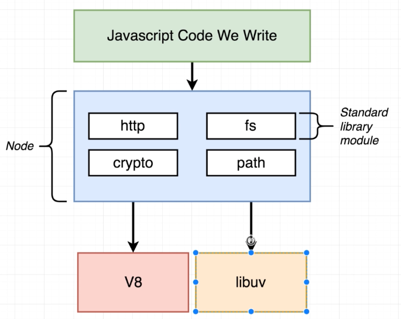
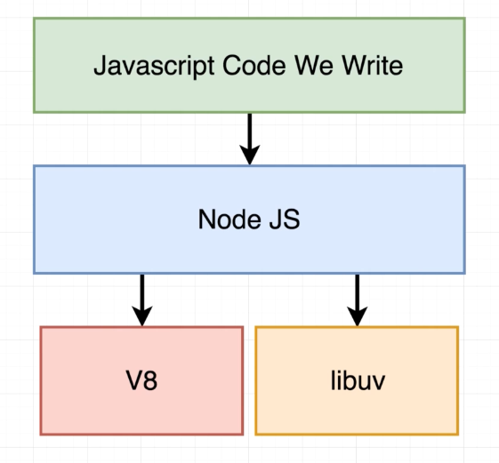
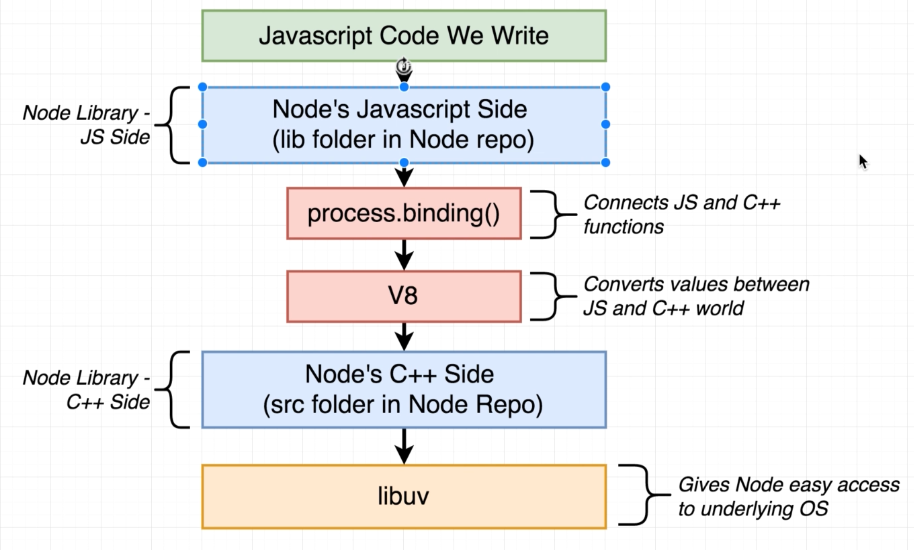

## Node JS internals Overview:
 - Node.JS is a library or a framework that's written in 50% JS and 50% C++.
 - It relies on two other frameworks, namely, V8, and Libuv.
 - V8 main functionality is to interpret the JS code we write and execte it, meanwhile libuv main functionality is to give nodejs access to the underlying operating system networking, concurrency, and filesystem.

    

 - Nodejs main purpose is to give us a consistent interface to underlying libraries functionality by implementing some modules.

    

## Example of how a Nodejs builtin Function works:

  - Let's have a look at `pbkdf2()` that's just an algorithm for hashing passwords with adding salt to it.
  - Go to https://www.github.com/nodejs/node , and there we only care about two folders, the `lib` and `src` folders -> Lib contains the JS definitions of the builtin functions and src contains the C++ impl (where libuv and v8 are used).
  - In lib/internal/crypto, we can find pbkdf2.js file. One important line is where `PBKDF2()` gets called, this is the C++ impl. and it is imported from this line `process.binding('crypto')`.

    

  - navigating to src/node_crypto.cc we will find a 5k+ lines file that conatins all crypto functionality that Node relies on.
  - Scrolling to the bottom of the file, we can see the methods being exported into env and that what links them to JS world (process.binding).
  - looking closely to this file, we will find al ot of `using v8::<TYPE>` and this is basically importing the C++ equivalent of JS TYPEs that is being used in our JS code.
  - Libuv also is used in this file for concurrency work.

## Node.JS Event loop:

 - when we run Nodejs, it spins up one thread, the event loop is a piece of code that's responsible for deciding what that single thread is supposed to do at any given moment in time.
 - Event loop could be imagined as a while loop, and the one execution of the while loop body is called tick.
 - Nodejs checks if it should execute another tick after:
    1. If still any pending functions registered by setTimeout, setInterval, setImmediate.
    2. Any pending OS tasks (Network, listening to ports, ...)
    3. If there are any long running processes (like reading a file from HD)

 - Nodejs immediately register the timer functions/FS calls/... as soon as our program runs, which in turn populate arrays simulating event loop ion code-examples folder.
 - In step three of the event loop, NodeJS actually wait till one of three event occurs and then continue the execution.
 - Event loop runs in a single thread, but many of the work is actually handled by the internal frameworks and libraries node relies on which are multi-threaded.
 - Like the previous example of `pbkdf2()`, it utilises libuv thread pool.

 - **Q1**: Can we use the thread pool for JS code? - Ans. Yes we can use it for our custom JS code
 - **Q2**: What functions in node std library use the threadpool? - Ans. All fs modules and some crypto ( Depends on OS)
 - **Q3**: How does threadpool fit into the evnt loop? - Ans. Tasks running in the threadpool are the `pendingOperations` in our psuedo-event-loop example.
 - Now in the file `async.js` we are testing the OS delegation in Nodejs, by making requests to google.com
 - All requests in that file takes the same time to complete, which is an evidence that the default thread pool (4 threads) is not being used.
 - Libuv just delegates the request to the OS and the OS decides how it handles the requests and gives the result back to libuv.
 - **Q1**: What functions in node std library use the OS's async features? - Ans. Almost everything around networking.
 - **Q2**: How does OS async fit into the evnt loop? - Ans. Tasks using OS are reflected in `pendingOSTasks` in our psuedo-event-loop example.
 
